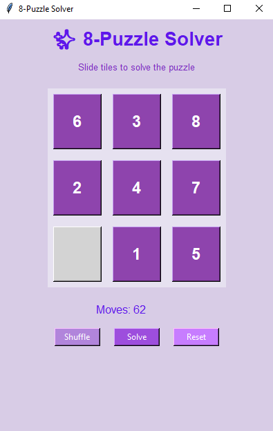
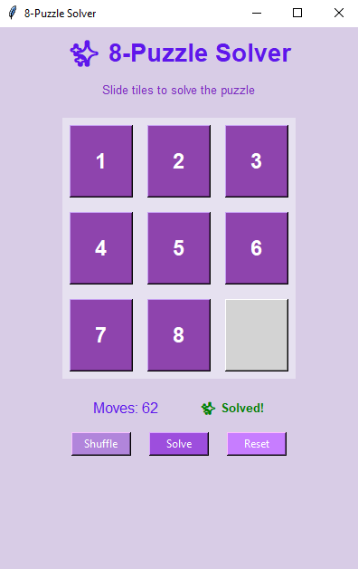

# 8-Puzzle Solver using A* Algorithm

An Artificial Intelligence project that solves the classic **8-Puzzle problem** using the **A* (A-Star) search algorithm** with the **Manhattan Distance heuristic**.  
The application includes an interactive **GUI built with Python Tkinter**, allowing users to shuffle the puzzle, solve it automatically, and track the number of moves.

---

## Project Overview

The 8-Puzzle is a sliding puzzle consisting of a **3×3 grid** with numbered tiles from **1 to 8** and one empty space.  
The objective is to arrange the tiles in the correct order by sliding them into the empty space.

This project uses the **A\* search algorithm**, an informed search technique that efficiently finds the optimal solution.

---

## Features

- Interactive **Graphical User Interface**
- **Shuffle** the puzzle randomly
- **Solve automatically using A\*** algorithm
- **Reset puzzle**
- **Move counter**
- Visual step-by-step solution

---

## AI Concepts Used

- State Space Representation
- Heuristic Search
- A* (A-Star) Algorithm
- Manhattan Distance Heuristic
- Path Reconstruction

---

## Technologies Used

- Python
- Tkinter (GUI)
- Priority Queue
- A* Search Algorithm

---
## Interface:

| Before | After |
|--------|-------|
|  |  |

---

## Learning Outcome

This project demonstrates how Artificial Intelligence search algorithms can be used to solve real-world problems efficiently by combining heuristics and state-space exploration.

---

## How to Run the Project

1. Download or clone the repository
2. Open the project folder
3. Run the Python file


```bash
python modern_8_puzzle.py
